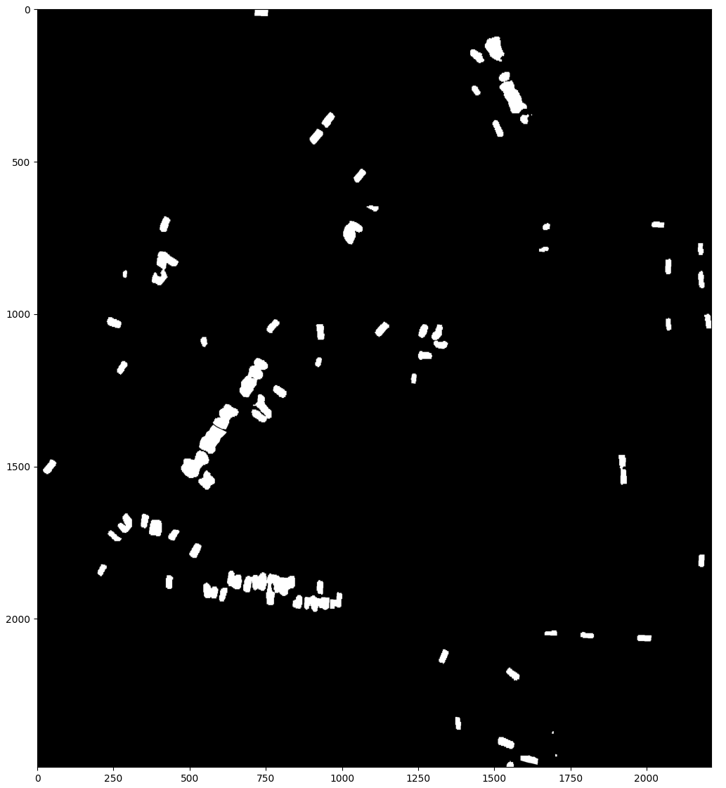
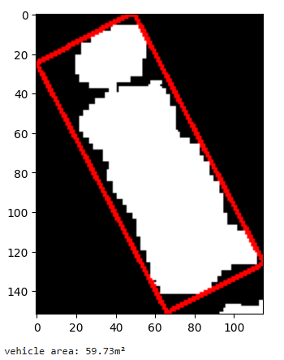
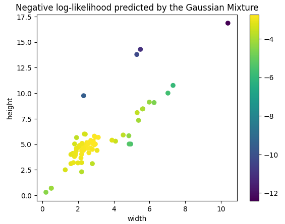
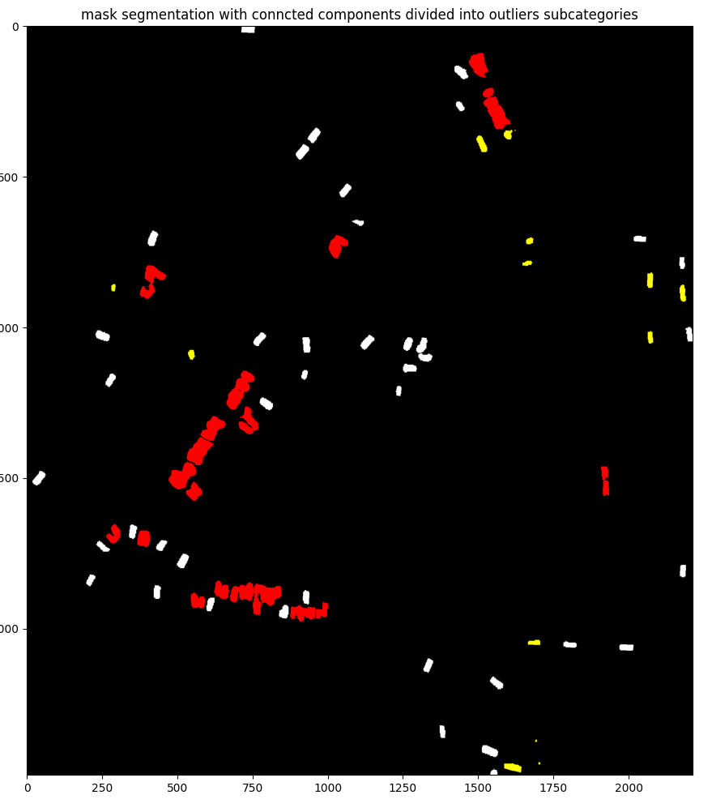

# Deep Learning Scientist Challenge

This page challenges many issues and pitfalls one can face when training/predicting vehicles and aircrafts
in satellite aerial images.

In a first part, we propose tricks and improvments for an aircrafts detection model on high resolution image satellite, according to some last training feedbacks and inference latency time constraint.

in a second part, we have to analyse a typical overfitting case for a Unet segmentation model, and propose solutions to make it converge.

In a last part, we are called to propose a python code to post-process a segmentation mask failing at separating some vehicles and fully locate some single vehicles. The objective behind is to have the right count of vehicles present into the image.

Those three problems are assessed in the following sections

## I/ Improve the model, please, it’s not good enough

The product manager asks you to improve an aircraft detector in order to reach very good
performances for the product.
Here are some feedbacks regarding the last successful training.


| observation | value |
---------------|-------
| architecture | RetinaNet |
| backbone | Resnet50 |
| test precision    | 80%  |  
| test recall       | 80%  |
| batch size   | 8    |
| rotate augmentation | -90, 90, 180|
| flipping augmentation | H, V |
| epochs | 100 |
| training size | 50000 |
| image size | 512*512 |
| max inference time | 1min |

We do not tolerate inference time above **5 mins**, and we would like to reach following test metrics

| expectation | value |
---------------|-------
| test precision    | 85%  |  
| test recall       | 90%  |


In the object detection field, aerial Images are hard use cases where objects of interest are very small and subject to clutter obstructions (clouds, shadows), if you consider that objects can be very rare, you also end up with an extremely imbalanced problem.
In that context, [RetinaNet (FAIR - 2017)](https://arxiv.org/pdf/1708.02002) is a good solution to tackle thoses challenges:

- *small objects detection*

  Instead of relying only on backbone last convolution map (where small objects are likely to disappear due to successive max pooling), RetinaNet also takes into account intermediate low level feature maps (FPN) to get chance of classifying and localing small objects

- *class imbalancing*

  RetinaNet extends classical cross entropy loss by multiplying the class probability log with a specific term called "focal" term. This term is supposed to lower the loss contribution when probability is close to 1 (which likely correspond to "easy" background majority class examples). This factor comes with a positive integer exponent to control how much you need to counter balance background "easy" examples. The following figure illustrates well factor impact:

  

In the next subsections, we will depict how we can enhance a RetinaNet in the context of aircrafts detection on aerial images, taking into account all quantitatives assumptions we have, particularly the time budget of 5 mins. There are 5 subsections described by decreasing priority order (get simple things done first)

- *Inference-only tricks*

  There are quick-wins because are fast to experiment so you can iterate a lot.

- *Training hyperparameters tuning*

  There are straightforward and automatic to experiment/select thanks to cross-validation

- *Object-detection hyperparameters tuning*

  Many framework allows to change those high level parameters very simply using config file (like [mmdetection - MMLab](https://github.com/open-mmlab/mmdetection) ) but input statistics and results feedback are needed to find the optimal values

- *Input data modifications*

  it needs deeper data analysis and sometimes field knowledge to apply data strategies that matter

- *Architecture/weight modifications*

  There are very challenging because they can change metrics a lot (overfitting for example) and one could need many iterations to figure out a decent set of hyperparameters


### I.1/ Inference-only tricks

Here is a list of tricks that do not need any re-training:

* One can avoid false detections and increase precision by simply increasing threshold on class probability. Note that a different threshold can be applied to each class giving more degrees of freedom.

* All object detections post process detections by removing those that overlap (above a certain IOU threshold) with a more confident detection. By lowering this threshold, you can remove more false alarms and increase precision

* RetinaNet (like most object detections) rely on anchors on original image around which we generate size-based and ratio-based rectangles (proposals). The model is then supposed to correctly label and refine them. There is a room for improvment if you can adapt the sizes/ratios to better match the expected target geometrics.

* When one target occluded another, NMS can remove a good detection associated to the occluded target because of overlapping. So instead of removing it, [soft-NMS - 2017](https://arxiv.org/abs/1704.04503) propose to *decays the detection score as a continuous function of the overlap*. As a result, recall can be improved as good occluded detections are now kept and get chances to pass threshold. One should first carefully assess results to be sure that poor recall are due to missing occluded targets, otherwise precision is likely to decrease due to more false alarm.

* Data augmentation has become mandatory in object detection. It allows to augment data in the context of low labelled data regime but it also benefits to inference as stated by recent paper [TTA - 2023](https://arxiv.org/pdf/2401.01018) that 
promote Test-Time Augmentation. The idea is to transform image multiple times, performs detections process in each and apply aggregations strategies to ensemble detections. The number of transformations should be limited to not
reach the 5 minutes time budget.


### I.2/ Training hyperparameters tuning


* Different learning rate strategy can be experimented like SGD used in original RetinaPaper

* Batch size can be increased for more stable convergence, but always constrained by GPU memory capacity limit

* the focal loss gamma parameter can be increased to more focus on foreground loss, then improving both precision and recall

* after a per-class analysis results, one can adapt per class weighting loss to better handle per class poor results.

* There is no information about training/val strategy, so we could go with a common pattern that randomly divide training into 90% train and 10% validation

* There is no information about metrics, but we can use Average Precision as validation metric to early stop training and avoid overfitting. 
Additionally, we can monitor APs, APm and APl metrics to assess how model performs on small, medium and large targets respectively, provided that it makes sense regarding our aerial images.


### I.3/ Object-detection hyperparameters tuning

- as stated in the subsection dedicated to inference-only tricks, we can also adapt sizes/ratios proposals early at training stage to fit with ground truth boxes distribution and make training more efficient

### I.4/ Input data modifications

Data augmentation allows model to see same given input in many configurations and provide better generalisation capacity. While rotations and flipping are very usual some other are worth to experiment, python packages like [albumentations](https://www.albumentations.ai/docs/3-basic-usage/bounding-boxes-augmentations/) and [imgaug](https://imgaug.readthedocs.io/en/latest/) are off-the shelf toolkits that carry out more advanced image/mask transformations:

* *random cropping* : interesting to let model learns foreground-only features

* *random cut*: interesting to mimic occluded/cluttered objects

* *decreasing contrast*: can mimic shadowed planes in aerial images

* *warping*: can mimic different aerial views

* *downscaling/upscaling*: mimic different altitudes for aerial images

* *fog/haze/blurring*: help to simulate weather bad conditions
	

### I.5/ Architecture/weight modifications

Following changes are more groundbreaking and need much experimentation time to overcome possible unexpected behaviors like overfitting

* Training can be performed from a RetineNet checkpoint trained on larger dataset like COCO

* Backbone Resnet50 can be progressively replaced by Resnet100 and then resnet 152 while carrefully assessed that you are not overfitting (hopefully, our data size is in the order of magnitude of CIFAR used by Resnet authors). TFLOPS operations increasing is linear so we should still be under the 5 mins budget


* If RetinaNet FPN is not using all layer maps, try adding more (specifically add the first conv maps if small objects are missing)


## II/ Models can be hard to train

Our segmentation model is running poorly and we need to provide a diagnosis and some corrections to reach a peformant training. Here are the observations made:

| Observation | value |
|-------------|-------|
| epochs      | 10    |
| training accuracy | increasing to 90% |
| validation accuracy | constant to 85% |
| masks | all background pixels in all epochs |


First of all, let's describe very briefly how Unet works. Unet is an end-to-end architecture for image to image use case, composed of two main seqential parts:

- *Encoder* 

  that convolve+downsize input image multiple times to extract feature maps at different scales

- *Decoder*

  that deconvolve the last feature map many times to reach the original image size, using skip connections from intermediate feature maps to get insights on input details at different scales.

Then the training learns to recreate the desired output image (segmentation mask, but can also be denoised image for example), meaning at each epoch:
- the encoder learns the feature maps that matter for target construction
- the decoder learns upscaling deconvolutions to construct target image using feature maps
Same as object detector, Unet uses well known CNN as encoder (backbone) to benefit from checkpoint image classification weights as initializer for fast and stable convergence.


In the following subsections, we will :

- Provide analyis on why predicted mask are background only pixels and how provided quantitative/qualitative observationsh helps in the issue iagnosis
((((- enumerate which complementary observations it would great to have to refine the issue diagnosis))))

- Explain how we can better monitor training to anticipate the issue

- Provide ideas and tricks that overcome the issue


### II.1/ Issue analysis

Here are the diagnosis bullet points according to assumptions made on last training:

- It appears that Unet has overfitted on background pixels very early due to class imbalancing, which is very common in segmentation use case.

- The fact that validation set reaches the plateau "immediately" shows that there is possible mismatch between train and val distributions

- This mismatch is corroborated by the difference of backgroud:building pixel ratio between train (90%) and validation (85%)

- The fact that training accuracy has rapidly reached the 90% plateau shows that learning rate is certainly too high

Following are the other statements we could make to enrich the diagnosis if we had the necessary feedbacks:

- Having access to feature maps would be helpful to verify if model is learning something (are the early maps responding at building pixels location?)

- Having access to image size distribution for training and validation would also be helpful to confirm if there is a mismatch between both distribution

- Having access to masks could let us count number of building pixels in each sample and plot train/val distributions, to also confirm if there is possible outliers in the validation set

### II.2/ Tricks and improvments

As we did in the first part, we will depict solutions from simple to advanced

- *Training hyperparameters*

	- First of all, we should switch to more advanced metrics like F1score, Precision and Recall when monitoring training, those metrics are more meaningful in the presence of imbalanced dataset
	
  - As stated in the previous section, learning seems high so we can keep ADAM optimizer but with a lower learning rate to prevent the model from reaching "easy" minimum
	
  - If the model shows high probability outputs for majority class during training, we can lower loss contributions of those "easy" examples using Focal loss
	
  - Overfitting can also be overcome using more basic tricks like dropout and early stopping

- *Data modifications*
	
  - Up-sample validation set to increase the background:building pixel ratio from 85% to 90%, thus matching training set pixel ratio.
	
  - Perform data augmentation, particularly random cropping to provide examples with majority building pixels and let model focus on buildings features extraction.

- *Architecture changes*
	
  - Add batch normalization layers in the architecture to help to reduce overfitting
	
  - Normalize the inputs to prevent any outliers from disturbing the training convergence
	
  - Using pretrained weights checkpoint allow to move the training starting point away from the "easy" minimum


# III/ DL model is the heart, but post-processing is important !

In this part, we will focus on the image segmentation mask of an aerial image, and its weaknesses to well isolate very small vehicles (few tens pixels ). We will propose a path to analyse the results and implement an efficient post processing step by step.

The source code we will use and demo below, can be found [here](https://github.com/ykacer/Deep_Learning_DataScientist_Challenge/src).

## III.1/ load shape file and explore data


In this subsection, we will do a brief data exploration by first using free opensoure qgis software to add two layers:
- Vectors from .shp file provided
- Tif raster provided

By adjusting the color transparency we can get an explorable illustration of the zone :


At the bottom right, we can identify the Geographic Coordinate System for the points, it is `EPSG:4326` also known as `WGS84`.

We will further use [utm](https://pypi.org/project/utm/) python package to convert those points into `UTM` Projected Coordinates System and get points as (x,y) coordinates in meters.


But first, we need to load the shapes using [pyshapefile](https://pypi.org/project/pyshp/) python package to read the shapefile containing a bouding box and a polygon points list associated to each shape.


```
>>> import shapefile
>>> sf = shapefile.Reader("Separation_Objets/cars")
>>> shapes = sf.shapes()
>>> len(shapes)
73
```

We can get the limit of the zone in terms of WGS84 Geographic Coordinates (longitude, latitude) and identify the zone in Google Earth (Syria):

```
>>> from src.utils.coordinates import get_bounding_box_zone
>>> get_bounding_box_zone(shapes)
((37.08373932980426, 36.6336931205609),
 (37.08617948676869, 36.6336931205609),
 (37.08617948676869, 36.63143895973405),
 (37.08373932980426, 36.63143895973405))
```


Let's then project the Geographic Coordinates into meters Project Coordinates UTM ...

```
>>> from src.utils.converter import project_and_normalize_shapes
>>> shapes_normalized = project_and_normalize_shapes(shapes)
```

... and use a function to re-build the mask with projected meters coordinates

```
>>> from src.core.morphology import get_cv2_contours_from_shapes
>>> from src.utils.display import draw_cc_from_contours
>>> draw_cc_from_contours(contours);
```


**Verification**: we have an image of size `2500x2500` pixels approximatively, where meters dimensions have been mutliplied by a factor of `10`. So if we compute the true perimeter as `P = 4 * 2500 / 10 = 1000m²`, we find a value close to the `919m²` displayed above by Google Earth interface.

## III.2/ Geometric analyses

The last mask above shows that we can play with connected components geometrics to idenfity a pattern that well characterize a vehicle.

More precisely, the idea is to get a distribution of height, width of bounding boxes of connected components to identify a strong cluster.

We expect to identify this cluster to well represent isolated and well-segmented vehicles

Let's plot height, width bounding boxes distribution

```
>>> import matplotlib.pyplot as plt
>>> hv = [shape.bbox[2] - shape.bbox[0] for shape in shapes_normalized]
>>> wv = [shape.bbox[3] - shape.bbox[1] for shape in shapes_normalized]
>>> plt.scatter(wv,hv);
>>> plt.xlabel("width")
>>> plt.ylabel("height")
>>> plt.title("(width, height) distribution of connected components")
>>> plt.show()
```


As expected, there is a good insight here as we show that most point are centered. But there is a room for improvement as vehicule can be rotated making height, width vehicles not exacty equal to the bounding box width, height.

That's why we propose to get better height, width vehicle by fitting the best rectangle on each connected component using [opencv](https://pypi.org/project/opencv-python/)

```
>>> from src.core.morphology import find_cc_best_enclosing_rectangles
>>> find_cc_best_enclosing_rectangles(shapes_normalized, contours)
```

Here after an illustration showing the best rectangle in red pixels for one of the connected component:



How does the height, width distribution behaves now? let's see it:

```
>>> hv = [shape.rectangle_height for shape in shapes_normalized]
>>> wv = [shape.rectangle_width for shape in shapes_normalized]
>>> plt.scatter(wv,hv);
>>> plt.xlabel("width")
>>> plt.ylabel("height")
>>> plt.title("(width, height) distribution of rectangle that best enclosed connected components")
>>> plt.show()
```


As expected, we finally get a more compact cluster showing that there is a simple pattern to separate well-isolated-and-segmented vehicules to other connected components

Let's confirm that assumption by fitting a 2D (width, height) Gaussian distribution and plot the scores to show *goodness of fit* of each connected component

```
>>> import numpy as np
>>> import sklearn

>>> gm = sklearn.mixture.GaussianMixture(n_components=1) # we use a mixture of gaussians model with only one component
>>> X = np.concatenate((np.array(wv)[:,np.newaxis],np.array(hv)[:,np.newaxis]), axis=1)
>>> gm.fit(X)
>>> scorev = gm.score_samples(X)

>>> sc = plt.scatter(wv, hv, c=scorev)
>>> plt.colorbar(sc)
>>> plt.title("Negative log-likelihood predicted by the Gaussian Mixture")
>>> plt.axis("tight")
>>> plt.xlabel("width")
>>> plt.ylabel("height")
>>> plt.show()
```



The gaussian mxiture provides an estimate of average vehicle size which is around `3m X 5,5m` (not far from the order of magnitude of real trucks sizes)

```
>>> print(gm.means_)
[[3.02695946 5.42500136]]
```

**Improvment**: we could get even better clusterisation by enriching height, width with other features like the ratio between vehicle area and rectangle area.

## III.3/ Connected components selection

From here, we can use the Gaussian Mixture model and apply a threshold `thresh` on Negative log-likelihood score to get
- connected components with log-likelihood above `thresh`, meaning the connected component is a well single segmented vehicle
- connected components with likelihood under `thresh` meaning the connected component is one of the two outliers subcategories
    - single but not well segmented vehicle or a false alarm
    - many vehicles merged into one segment

The two outliers subcategories can then be separated by comparing `height x weight` product to the Gaussian mean (below and above to respectively get the first subcategory and the second one)


Let's execute the following function that apply the process from gaussian fitting to the two outliers subcategories groups, using the shapes with their best enclosing rectangles

```
from src.core.morphology import find_cc_outliers
mean_size, contours_good_category, contours_outliers_subcategory1, contours_outliers_subcategory2, index_good_category, index_outliers_subcategory1, index_outliers_subcategory2 = find_cc_outliers(shapes_normalized, contours, thresh=-3.1, plot=True)
```

We find `threshold = -3.1` to be a good trade-off, here are the displayed results:
- Single not well segmented or fa in yellow
- Merged vehcles in red
- Good segmentations in white

```
from src.utils.display import draw_cc_categories_from_contours
draw_cc_categories_from_contours(contours_good_category, contours_outliers_subcategory1, contours_outliers_subcategory2)
```


## III.4/ Vehicle counting

The following table enumerates vehicles according to their category

| category | counting |
|-------------|-------|
| good vehicles      | 41   |
| single not well segmented vehicles or fa | 14 |
| merged vehicles | 18 |

We can loop over *merged vehicles*, get the number of connected component pixels (equivalent to area of the supposed merged vehicles) and divide it by the the mean vehicle size (gaussian average). The closest integer can then be interpreted as the true number of vehicles and enrich the counting for the *good vehicles*.

```
>>> merged_vehicles_recounting = 0
>>> for cc_index in index_outliers_subcategory2:
    ... recounting = round(shapes_normalized[cc_index].vehicles_area/mean_size)
    ... merged_vehicles_recounting += recounting
>>> print(merged_vehicles_recounting)
42
```

Finally, we can a display finer distribution of the categories counts

| category | counting |
|-------------|-------|
| good vehicles      | 41 + 42 = 83  |
| single not well segmented vehicles or fa | 14 |

In the last subsection, we propose a solution to handle the last subcategory of outliers : those which are single not well segmented vehicles or false alarms and better recounting them

## III.4/ Single not well segmented vehicles or false alarm

In this subsection, we briefly propose a solution to keep the true vehicles and discard the false alarm.

We have a single connected component for each but also the cropped image of the associated zone using the tif raster.

It could be interesting to use Watershed Segmentation to do a finer and fast segmentation. The connected could be eroded a little bit and used as marker for the Watershaed.
The resulting segment can then used to get:
- the best enclosing rectangle
- verify is it fit with the Gaussian model using our threshold
- those that pass the Gaussian "goodness of fit" can be considered true vehicle while other are discarded
